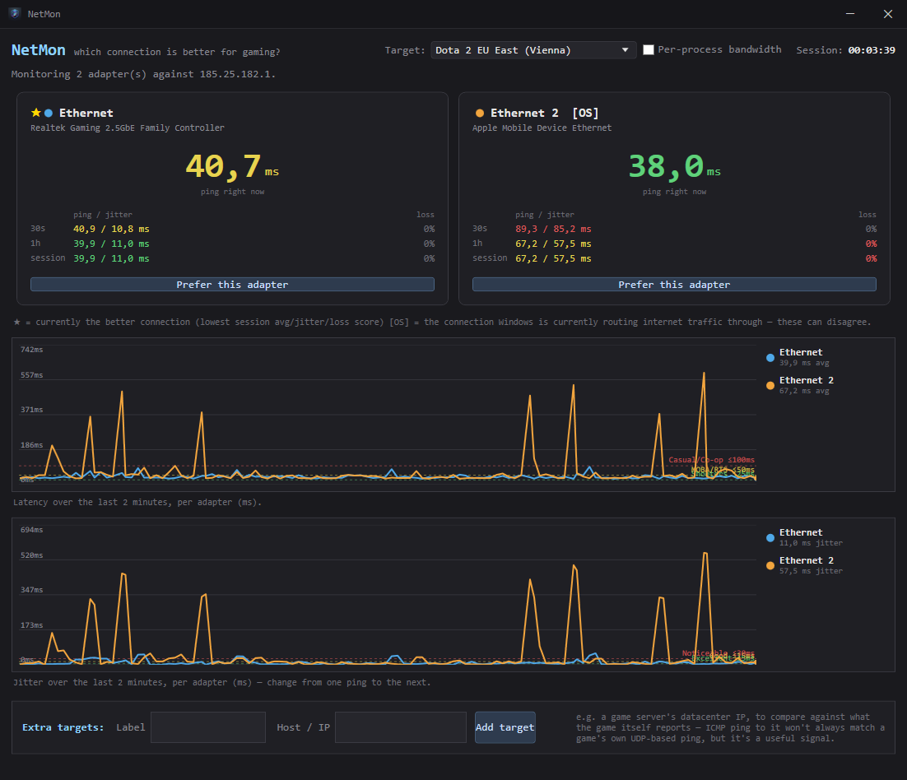

# NetMon — which connection is better for gaming?

[](https://github.com/lucidlemon/netmon/actions/workflows/ci.yml)
[](https://github.com/lucidlemon/netmon/releases/latest)

> **⚠️ Disclaimer:** This app is **100% vibecoded** — written by an AI
> ([Claude](https://claude.com/claude-code)) from natural-language instructions,
> with no professional security or code audit. It's a hobby project, provided
> **as-is, with no warranty of any kind**. I (the author) take **no
> responsibility for any damage, data loss, security issue, or other harm**
> that may result from downloading, building, or running it. Review the code
> yourself if that matters to you — it's all in this repo. See
> [Security scanning](#security-scanning) below for what's automatically
> checked, and use at your own risk.

Two versions live here:

- **NetMonGui** — a standalone desktop app with a live table *and* a latency
  graph per adapter, plus a button to tell Windows to actually prefer your
  best connection. This is the one most people want. See
  [below](#netmongui--desktop-app).
- **netmon.ps1** — the original single-file PowerShell script, console only,
  zero build tools required. See [Console version](#console-version-netmonps1).

Both measure the same thing: pings every active network connection on your PC
(Ethernet, USB tether, Wi-Fi — whatever is plugged in and up) once a second,
from that connection specifically, and show latency + jitter + packet loss
over three windows:

- **Now** — last ~3 seconds
- **30s** — last 30 seconds
- **1h** — rolling last hour
- **Session** — since you started the tool

The connection with the best combined score (low latency, low jitter, low loss)
is marked with `*`. The connection Windows is *currently actually using* for
internet traffic (based on route + interface metric) is marked `[OS]` — these
two can disagree, e.g. Windows may default to Ethernet by metric even while
your hotspot is measurably better, in which case Dota 2/CS2 (and everything
else) are routing over the worse link without you knowing.



**Admin rights**: NetMon runs unprivileged by default and never asks for
elevation on its own. It only prompts for admin (a UAC dialog) when *you*
click something that needs it:
- **"Prefer this adapter"** — needs admin to change the adapter's network
  metric. See [Adapter priority](#adapter-priority).
- **"Per-process bandwidth"** — needs the whole app running elevated to read
  per-process network activity. See [Per-process bandwidth](#per-process-bandwidth).

Nothing else in the app ever touches either.

## NetMonGui — desktop app

A Windows app with a live table, a graph, and a few things the console
version can't do:

- **Live latency and jitter graphs** — one line per adapter, last 2 minutes,
  stacked below the table, so you can *see* the difference instead of reading
  numbers.
- **"Prefer this adapter"** — see [Adapter priority](#adapter-priority) below.
- **Per-process bandwidth** — see [below](#per-process-bandwidth): which app
  is actually eating your connection when things get laggy.

### Getting it

Grab the latest build from **[Releases](https://github.com/lucidlemon/netmon/releases/latest)** — two options:

- **`NetMonGui-win-Setup.exe`** (recommended) — installs to your user folder
  (no admin needed), adds Start Menu/Desktop shortcuts, and **auto-updates**:
  NetMon quietly checks for a newer release on startup, downloads it in the
  background, and restarts itself to apply it when one's found. You'll always
  be on the latest version without thinking about it.
- **`NetMonGui-portable-vX.Y.Z.exe`** — a single file, nothing installed,
  nothing written outside the folder it's in. Doesn't auto-update — grab a
  new one from Releases when you want the latest.

Or build it yourself locally — see [Building](#building).

### Adapter priority

Windows doesn't expose a "prefer this connection" toggle in Settings, but the
mechanism it uses internally is scriptable: every adapter has an *interface
metric*, and Windows routes traffic over whichever active default route has
the lowest effective metric (route metric + interface metric). Click
**"Prefer this adapter"** on the row you want and the app will:

1. Ask Windows for elevation (a UAC prompt — the app itself runs unprivileged,
   only this one action needs admin rights).
2. Lower that adapter's IPv4 metric to `1`.
3. Reset the other monitored adapters back to automatic metric.

Windows re-evaluates routes shortly after, and the `[OS]` marker in the table
will move to confirm it took effect. This is a real, persistent change to your
network configuration (it survives reboots) — nothing here is fake or purely
cosmetic. If you ever want to undo it by hand:

```
Set-NetIPInterface -InterfaceAlias "<adapter name>" -AutomaticMetric Enabled
```

### Per-process bandwidth

Tick **"Per-process bandwidth"** next to the target box and NetMon shows a
live table of the top 10 processes sending/receiving data, with a
**Current / Total** switch in the corner: *Current* ranks by live throughput
(what's hogging the connection right now), *Total* ranks by total data moved
this session (down + up combined, shown as KB/MB/GB in its own column) — the
one to check if something quietly downloaded gigabytes in the background.
Once a process shows up it stays tracked even if it goes quiet, so a chatty
process that's briefly idle doesn't vanish from the list.

This needs to see which process owns each network packet, which only kernel
code can tell you — same mechanism Task Manager's Network column and Resource
Monitor use (a realtime ETW trace on the network kernel provider). That means
it only works elevated:

1. If NetMon isn't already running as administrator, ticking the box asks to
   restart it as admin (one UAC prompt). Your session stats reset when it
   restarts — the adapter table starts fresh.
2. Untick it any time to stop tracking; the panel disappears and no admin
   rights are needed for anything else in the app.

Nothing here is persistent — it's a live trace, not a log, and stops the
moment you untick the box or close the app.

### Building

Requires the .NET SDK (comes with Visual Studio's ".NET desktop development"
workload, or install the SDK standalone). From this folder:

```
Build-NetMonGui.bat
```

or manually:

```
cd NetMonGui
dotnet publish -c Release
```

That produces one self-contained `NetMonGui.exe` (~65 MB — it bundles the
.NET runtime, so it runs on any Windows 10/11 x64 PC with nothing else
installed) at `NetMonGui\bin\Release\net10.0-windows\win-x64\publish\`.
`Build-NetMonGui.bat` also copies it up to the repo root for convenience.
This is the portable build — same as what's on the Releases page, just built
locally, and it won't auto-update.

### Releases & auto-update (for maintainers)

[`.github/workflows/release.yml`](.github/workflows/release.yml) builds and
publishes a new GitHub Release automatically on every push to `main`, using
[Velopack](https://velopack.io) to package `NetMonGui-win-Setup.exe` (with an
update feed) plus the portable exe. To cut a release: bump `<Version>` in
[`NetMonGui/NetMonGui.csproj`](NetMonGui/NetMonGui.csproj) and merge to
`main` — pushing without bumping it will just fail the workflow (that version
already exists on GitHub).

[`.github/workflows/ci.yml`](.github/workflows/ci.yml) does a plain build
check on every other branch/PR, no packaging.

The app checks this repo's Releases for updates on every startup
(`NetMonGui/Services/UpdateService.cs`) — silently, and only when installed
via `Setup.exe` (the portable exe and `dotnet run` are no-ops here, there's
nothing to update in place). It's all best-effort: no network, GitHub rate
limits, or no releases yet all fail silently rather than bothering you.

## Security scanning

Since this is vibecoded (see the disclaimer up top) and I'm not a security
professional, the repo runs GitHub's free automated checks on every push, all
configured under [`.github/`](.github/):

- **[CodeQL](.github/workflows/codeql.yml)** — static analysis for common
  vulnerability patterns (injection, unsafe deserialization, etc.), on every
  push/PR to `main` plus a weekly scheduled scan. Results show up under the
  repo's **Security → Code scanning** tab.
- **[Dependabot](.github/dependabot.yml)** — weekly checks for known CVEs in
  NuGet packages and GitHub Actions versions, opens a PR automatically when
  one needs bumping. Results under **Security → Dependabot**.
- **Secret scanning** — GitHub's own, on by default for public repos, no
  config needed; flags anything that looks like a committed credential.

None of this is a substitute for a real audit, and none of it looks at the
things that matter most here — like whether "click this button to have
Windows change your route metric" or "restart elevated to read per-process
ETW data" are things *you're* comfortable with an app doing. Read
[Adapter priority](#adapter-priority) and
[Per-process bandwidth](#per-process-bandwidth) above and judge that part
yourself.

## Stream Deck plugin

[`streamdeck-plugin/`](streamdeck-plugin/) has an Elgato Stream Deck plugin
that puts live ping or jitter for a chosen connection on a key, color-coded
with the same thresholds as the app's charts. It talks to NetMonGui over a
small loopback-only JSON API the app exposes automatically
(`NetMonGui/Services/StatsApiService.cs`, `http://127.0.0.1:47115/api/status`)
— no configuration needed on the app side, just have it running. See
[streamdeck-plugin/README.md](streamdeck-plugin/README.md) for building and
installing it.

## Console version (netmon.ps1)

No install required — it's a single PowerShell script, and PowerShell ships with
every Windows PC. Nothing to download, nothing to trust except this one file.
No graph, no adapter-priority button — just the table, in a terminal.

### Run it

Double-click **Run-NetMon.bat**, or from a terminal:

```
powershell -ExecutionPolicy Bypass -File netmon.ps1
```

Press `Ctrl+C` to stop — it'll print a final summary table before exiting.

If you plug in a new connection (e.g. your iPhone hotspot) while it's running,
it'll pick it up automatically within a few seconds. If you unplug one, it drops
off the table (its stats are gone — this is a live monitor, not a logger).

### How it works

For each active, non-virtual network adapter (VPNs, Hyper-V, loopback etc. are
skipped automatically), it sends one ICMP ping per second **sourced from that
adapter's IP** (`ping -S <adapter-ip> <target>`), so the Ethernet ping and the
hotspot ping are truly independent — both really travel over their own physical
link, not just whichever route Windows would pick by default. It's a single
32-byte packet per second per connection — negligible bandwidth, won't affect
your game.

Jitter is the average difference between consecutive pings (the standard
definition used by most game/network tools) — this tends to matter more than
raw ping for shooters/MOBAs, since it's what causes rubber-banding and
inconsistent hit registration even when average ping looks fine.

### Options

```
powershell -File netmon.ps1 [-Target <ip>] [-IntervalMs 1000] [-TimeoutMs 1000] [-RediscoverEverySec 5]
```

- `-Target` — what to ping. Defaults to `1.1.1.1` (Cloudflare, reliable and low-latency
  almost everywhere). You can point it at any IP — e.g. a specific game server IP if
  you can find one in your game's network diagnostics, for a more direct comparison.
- `-IntervalMs` / `-TimeoutMs` — how often to ping and how long to wait for a reply.
- `-MaxIterations` — stop automatically after N ticks (handy for a timed test, e.g.
  `-MaxIterations 300` for a ~5 minute run with `-IntervalMs 1000`).

### Sharing with friends

Just send them the whole folder (or zip it): `netmon.ps1`, `Run-NetMon.bat`, this
README. They double-click `Run-NetMon.bat` — no Python, no .NET, no install. Works
on any Windows PC.

Or just point them at the [Releases page](https://github.com/lucidlemon/netmon/releases/latest).
